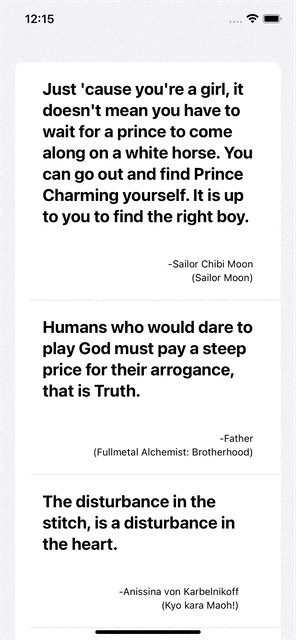

# AnimeQuotes
A simple beginner project illustrating basic API usage with a swiftui frontend
The app is a very easy to follow example on using the async / await concepts of swiftui to make a simple network request to the API [Animechan](https://animechan.vercel.app)

It gets back a JSON with 10 random quotes from 10 random anime's , This is a basic starter pack , if you want more practice you can build upon more as the api has 
other query supports like getting quotes from specific queried anime's ,out and out a basic template for you to practice your skills , This project also implements the pull to refresh feature in iOS and the MVVM model

## Demo

